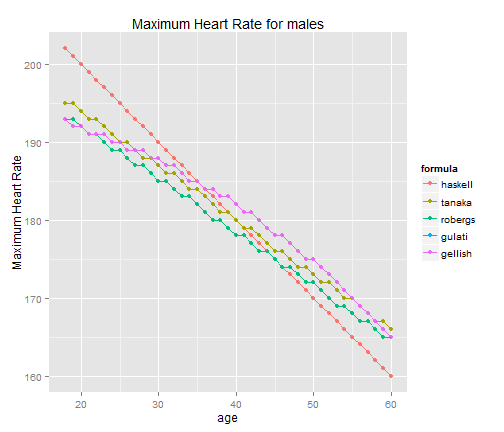
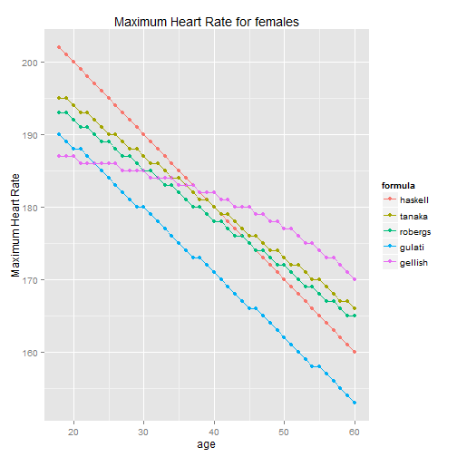

Maximum Heart Rate
========================================================
author: Massimo Zanetti
date: June 12, 2015
font-family: 'Consolas'
transition: concave

<small>
Assignment for  
Data Developing Products Course  
Data Science Specialization  
</small>


Summary
========================================================
  
The maximum heart rate (HRmax) is the highest heart rate an individual 
can achieve without severe problems through exercise stress, 
and generally decreases with age.
The most accurate way of measuring any single person's HRmax is via a cardiac stress test.
For general purposes, a formula is often employed to estimate a person's maximum heart rate.
Some formulas are differentiated between males and females.  
[Wikipedia](https://en.wikipedia.org/wiki/Heart_rate)  
In the next slides we show some examples of HRmax calculated using different formulas.


Dataset Preparation
========================================================

We create a dataset with age between 18 and 60 and a column with gender, then we compute the maximum heart rate using different formulas.


```r
  dataset <- data.frame( age= rep(18:60,2) , gender= rep(c("F","M"),each=43))    
  
  
   dataset$haskell <- round( 220- dataset$age ,0)
   dataset$tanaka  <- round( 208 - (0.7 * dataset$age) ,0)
   dataset$robergs <- round( 205.8 - (0.685 * dataset$age) ,0)
   dataset$gulati  <- rep("Women Only" ,86 ) 
   dataset$gulati[dataset$gender=="F"]  <- round( 206 - (0.88 * dataset$age[dataset$gender=="F"]),0 )   
   dataset$gellish <- round (203.7 / ( 1 + exp( 0.033*(dataset$age -104.3) ) )  ,0)
   dataset$gellish[dataset$gender=="F"] <- round( 190.2 / ( 1 + exp( 0.0453*(dataset$age[dataset$gender=="F"]-107.5) ) ),0)  
```


Charts - MHR for males
========================================================
left: 60%


***
We show the heart rates for males.  
It is possible to see the decline in maximum heart rate  
with the increase in age.


Charts - MHR for females
========================================================
left:60%
 
  ***
  We can see the maximum heart rate for females is more variable.
